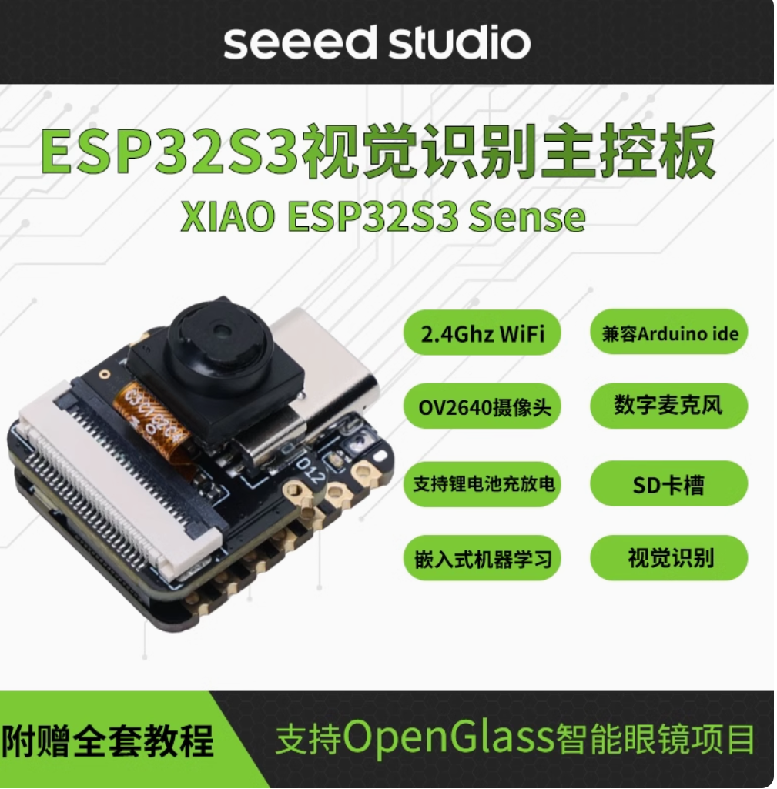

# MiGPT + Camera：智能家居，从此开始

Camera硬件使用的是OpenGlass项目中的硬件



请先安装好mi-gpt支持库，再安装ble蓝牙支持库

```shell
npm install @abandonware/noble
```

安装启动多模态图片解析大模型API库，参考[https://ollama.com](https://ollama.com)

```shell
ollama run llava
```

编译启动项目

```shell
npm run build
npm start
```

## 🚨 免责声明

本项目仅供学习和研究目的，不得用于任何商业活动。用户在使用本项目时应遵守所在地区的法律法规，对于违法使用所导致的后果，本项目及作者不承担任何责任。
本项目可能存在未知的缺陷和风险（包括但不限于设备损坏和账号封禁等），使用者应自行承担使用本项目所产生的所有风险及责任。
作者不保证本项目的准确性、完整性、及时性、可靠性，也不承担任何因使用本项目而产生的任何损失或损害责任。
使用本项目即表示您已阅读并同意本免责声明的全部内容。

## ❤️ 鸣谢

- <https://github.com/idootop/mi-gpt.git>
- <https://github.com/BasedHardware/OpenGlass.git>
- <https://github.com/tigoe/BluetoothLE-Examples.git>
